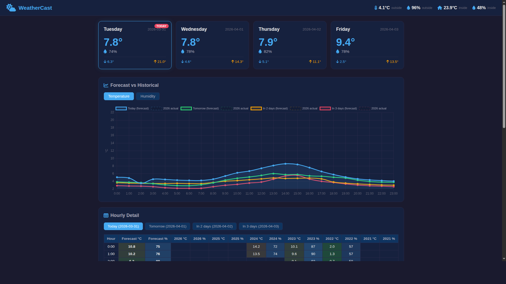

# WeatherStation

A full-stack IoT weather station that measures indoor and outdoor temperature and humidity using an **ESP8266** microcontroller with **DHT11/DHT22** sensors. Data is sent to a **Raspberry Pi** server running **PHP** and **MySQL**, displayed on a web dashboard with interactive charts, accessible via an **Android app**, and shown as a **Windows Rainmeter** desktop widget.


## Features

- **Dual-sensor measurement** using DHT11 (indoor) and DHT22 (outdoor) sensors connected to an ESP8266 via twisted-pair cable
- **Automatic data logging** with the ESP8266 periodically sending temperature and humidity readings to the server via HTTP GET requests
- **API-key authentication** protecting data ingestion and retrieval endpoints from unauthorized access
- **MySQL persistence** storing timestamped indoor/outdoor temperature and humidity records
- **Interactive web dashboard** with CanvasJS stacked area charts showing historical temperature and humidity trends, plus a latest-reading summary with Font Awesome icons
- **JSON data export** written to `readmeteo.json` on every sensor update for lightweight consumption by widgets
- **Android companion app** using a WebView to display the web dashboard natively on mobile devices
- **Windows Rainmeter widget** polling the JSON endpoint every 5 minutes to display current readings on the desktop
- **Mains-powered design** for uninterrupted 24/7 operation
- **Weather forecast dashboard** using weighted historical averages and recent trend extrapolation to predict temperature and humidity for up to 7 days, with interactive Chart.js charts, hourly detail tables, and a dark-themed responsive UI

## Screenshots

### Web Dashboard


### Windows Rainmeter Widget


### Forecast Dashboard



### Android Application


## Hardware Components

| Component | Purpose |
|-----------|---------|
| Raspberry Pi 4 (4 GiB RAM) | Web server hosting PHP/MySQL backend |
| ESP8266 (NodeMCU) | Microcontroller reading sensors and sending data over WiFi |
| DHT11 sensor | Indoor temperature and humidity measurement |
| DHT22 sensor | Outdoor temperature and humidity measurement (higher precision) |
| Twisted-pair cable (~2m) | Wired connection between sensors and ESP8266 |

## Software Dependencies

### Server (Raspberry Pi)

| Dependency | Purpose |
|------------|---------|
| Apache / Nginx | Web server |
| PHP 7.x+ | Backend scripts |
| MySQL 5.7+ / MariaDB | Data storage |

### Android App

| Library | Version | Purpose |
|---------|---------|---------|
| AndroidX AppCompat | 1.3.1 | Backward-compatible Activity |
| Material Components | 1.4.0 | Material Design theming |
| ConstraintLayout | 2.1.1 | Layout manager |

### Web Dashboard

| Library | Purpose |
|---------|---------|
| [CanvasJS](https://canvasjs.com/) | Interactive stacked area charts |
| [Font Awesome](https://fontawesome.com/) 5.7 | Temperature and humidity icons |

### Forecast Dashboard

| Library | Purpose |
|---------|---------|
| [Chart.js](https://www.chartjs.org/) | Forecast and trend line charts |
| [Font Awesome](https://fontawesome.com/) 6.5 | Weather and UI icons |

### Windows Widget

| Dependency | Purpose |
|------------|---------|
| [Rainmeter](https://www.rainmeter.net/) | Desktop widget engine |

## Setup

### 1. Database

Create a MySQL database and table:

```sql
CREATE DATABASE meteo;
USE meteo;

CREATE TABLE your_station_name (
    id INT AUTO_INCREMENT PRIMARY KEY,
    temperatureIN FLOAT,
    humidityIN FLOAT,
    temperatureOUT FLOAT,
    humidityOUT FLOAT,
    timestamp TIMESTAMP DEFAULT CURRENT_TIMESTAMP
);
```

### 2. Server Configuration

Edit `PHP+MySQL/config.php` with your database credentials and API key:

```php
$db_host = 'localhost';
$db_user = 'meteo_dbuser';
$db_pass = 'your_password';
$db_name = 'meteo';
$write_api_key = 'your_api_key';
```

Deploy the PHP files to your web server document root.

### 3. ESP8266 Firmware

Flash the ESP8266 with firmware configured to:
- Read DHT11 and DHT22 sensors
- Send HTTP GET requests to `espdata.php` with parameters: `api_key`, `station_id`, `tIN`, `hIN`, `tOUT`, `hOUT`
- Use the same API key as configured in `config.php`

### 4. Forecast Dashboard

Deploy the `Forecast/` directory to your web server. The forecast frontend (`forecast.html`) fetches data from `forecast_api.php`, which analyzes historical sensor data to generate predictions.

The forecast algorithm blends:
- **70% weighted historical average** — same calendar date ±3 days across all recorded years, with recent years weighted higher
- **30% recent trend extrapolation** — linear regression over the last 3 days of readings

```
# Example: deploy to web server
cp Forecast/forecast_api.php /var/www/html/
cp Forecast/forecast.html /var/www/html/
cp Forecast/forecast.js /var/www/html/
cp Forecast/forecast_style.css /var/www/html/
```

The `forecast_backup.php` is an older server-rendered version that displays raw historical temperature/humidity tables with color-coded cells.

### 5. Android App

Open the `Aplikacja Android/meteo/` project in Android Studio, update the server URL in `MainActivity.java`, and build:

```bash
cd "Aplikacja Android/meteo"
./gradlew assembleDebug
```

### 6. Rainmeter Widget

Copy the `Rainmeter/meteo/Meteo/` folder to your Rainmeter skins directory (typically `Documents\Rainmeter\Skins\`). The widget polls the JSON endpoint every 5 minutes (300000 ms).

## API Endpoints

### Data Ingestion

```
GET /espdata.php?api_key=KEY&station_id=TABLE&tIN=22.5&hIN=45&tOUT=15.3&hOUT=62
```

Stores a measurement and writes the latest reading to `readmeteo.json`. Returns `OK` on success.

### Dashboard with Charts

```
GET /meteochart.php?api_key=KEY&station_id=TABLE
```

Renders an HTML page with the latest readings and a historical chart of all recorded data.

### Weather Forecast API

```
GET /forecast_api.php?days=4
```

Returns a JSON object with current conditions, recent trend data, and forecast for each requested day (up to 7). Each day includes hourly temperature/humidity predictions and historical data from the same date across all recorded years.

### JSON Latest Reading

```
GET /readmeteo.json
```

Returns the most recent measurement in JSON format, consumed by the Rainmeter widget:

```json
{
    "time": "2024-01-15 14:30:00",
    "tIN": "22.5",
    "hIN": "45",
    "tOUT": "15.3",
    "hOut": "62"
}
```

## Project Structure

```
WeatherStation/
├── README.md                                       # This file
├── PHP+MySQL/                                      # Server-side backend
│   ├── config.php                                  # Database credentials and API key (template)
│   ├── espdata.php                                 # Data ingestion endpoint (ESP8266 -> DB + JSON)
│   └── meteochart.php                              # Web dashboard with charts and latest readings
├── Forecast/                                       # Weather forecast module
│   ├── forecast_api.php                            # Forecast JSON API (historical + trend blend)
│   ├── forecast.html                               # Modern dark-themed forecast dashboard
│   ├── forecast.js                                 # Chart.js rendering and UI logic
│   ├── forecast_style.css                          # Dashboard styles (responsive, dark theme)
│   ├── forecast_backup.php                         # Legacy server-rendered historical tables
│   └── screenshots/
│       └── forecast_dashboard.png                  # Screenshot of the forecast dashboard
├── Aplikacja Android/                              # Android companion app
│   └── meteo/
│       ├── app/
│       │   ├── build.gradle                        # App build configuration
│       │   └── src/main/
│       │       ├── AndroidManifest.xml              # App manifest
│       │       ├── java/.../MainActivity.java       # WebView loading the dashboard URL
│       │       └── res/                             # Layouts, icons, themes
│       ├── build.gradle                            # Project-level Gradle config
│       └── settings.gradle                         # Gradle settings
└── Rainmeter/                                      # Windows desktop widget
    └── meteo/Meteo/
        └── meteo.ini                               # Rainmeter skin parsing readmeteo.json
```

## License

This project is provided as-is for educational purposes.
